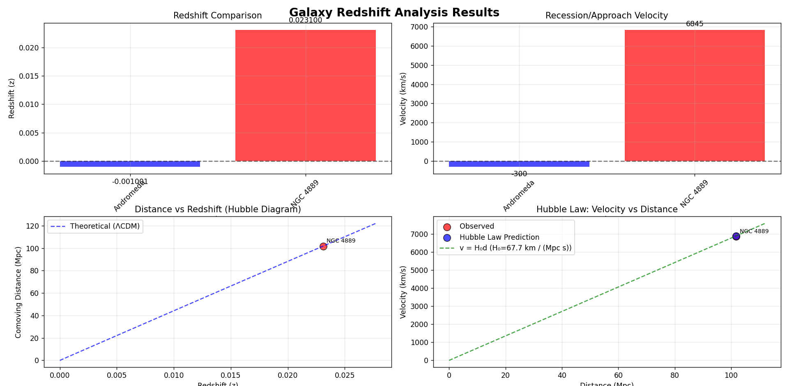
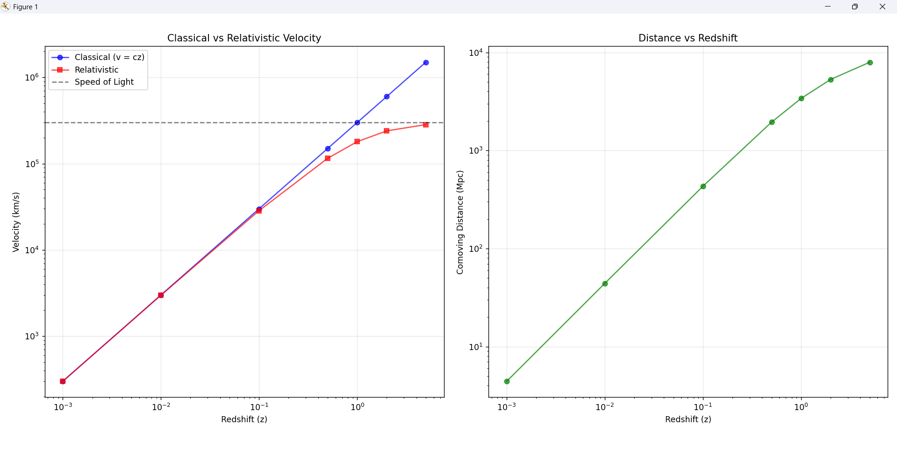

# 🌌 Galaxy Redshift Analyzer

A Python-based tool for analyzing galaxy redshifts, computing velocities and distances using both classical and relativistic approaches, and comparing results with cosmological predictions based on the Planck18 ΛCDM model.

---

## 📈 Features

- Compute **redshift-based velocity** (both classical and relativistic)
- Derive **cosmological distances**: luminosity, angular, comoving, and lookback
- Visualize relationships: velocity vs redshift, Hubble law, etc.
- Analyze **local (blue-shifted)** and **distant (red-shifted)** galaxies
- Demonstrate redshift behavior across a wide range

---

## 📁 Files Included

- **galaxy_redshift_analyzer.py**  
  Main Python script for analyzing galaxy redshifts and computing velocities/distances.

- **Figure_1.png**  
  Log-log plot visualizing redshift vs. velocity and distance.

- **Figure_2.png**  
  Full analysis visualization for Andromeda and NGC 4889.

- **README.md**  
  Project documentation (this file).


---

## 🖼️ Example Plots

### Galaxy Redshift Analysis


### Velocity vs Distance vs Redshift Relativistic analysis 


---

## 📦 Dependencies

Install required packages using:

```bash
uv add numpy matplotlib astropy
```

## 🚀 How to Run

Run the script with:

```bash
uv run redshift.py
```

This will perform:

- Redshift calculation
- Velocity computation
- Cosmological distance estimation
- Visualization


---

## 📝 Output Summary

After running the script, you will receive:

- Tabulated results for each galaxy: redshift, velocity (classical & relativistic), and distances
- Plots saved as PNG files in the working directory
- Console output summarizing key findings and any anomalies detected
- Clear distinction between local and distant galaxy behavior
- Comparison with ΛCDM cosmological predictions
---

## 🔬 Galaxy Redshift Analysis

**Using cosmology:** Planck18  
**H₀:** 67.66 km/(Mpc·s)  
**Ωₘ:** 0.310  
**ΩΛ:** 0.689

---

### 🌀 Andromeda (M31)

- **Type:** Spiral Galaxy
- **Given redshift (z):** -0.001001
- **Calculated redshift:** 0.000029
- **Rest wavelength:** 656.281 nm
- **Observed wavelength:** 656.300 nm

#### 🚀 Velocity Calculations

- **Classical (v = cz):** 300.1 km/s
- **Relativistic:** 299.9 km/s
- **Direction:** APPROACHING (blue-shifted)

> **Note:** Negative redshift indicates local motion, not cosmological expansion.  
> **Distance calculation not applicable for blue-shifted objects.**  
> Nearest major galaxy, blue-shifted due to local motion.

---

### 🪐 NGC 4889 (Coma Cluster)

- **Type:** Elliptical Galaxy
- **Given redshift (z):** 0.023100
- **Calculated redshift:** 0.023037
- **Rest wavelength:** 656.281 nm
- **Observed wavelength:** 671.400 nm

#### 🚀 Velocity Calculations

- **Classical (v = cz):** 6925.2 km/s
- **Relativistic:** 6845.2 km/s
- **Direction:** RECEDING (red-shifted)

#### 📏 Distance Calculations

- **Luminosity distance:** 104.15 Mpc
- **Angular diameter distance:** 99.50 Mpc
- **Comoving distance:** 101.80 Mpc
- **Light travel distance:** 100.64 Mpc

#### 📊 Hubble Law Comparison

- **Expected Hubble velocity:** 6887.7 km/s
- **Observed velocity:** 6845.2 km/s

> **Notes:** Galaxy in Coma Cluster, exhibiting cosmological redshift.

---

## 🌐 Redshift Range Demonstration

The following table summarizes how velocity and distance estimates change across a wide range of redshifts, using both classical and relativistic calculations, along with cosmological distances and lookback times.

| Redshift (z) | Classical Velocity (km/s) | Relativistic Velocity (km/s) | Distance (Mpc) | Lookback Time (Gyr) |
|:------------:|:------------------------:|:----------------------------:|:--------------:|:-------------------:|
| 0.001        | 300                      | 300                          | 4              | 0.01                |
| 0.010        | 2,998                    | 2,983                        | 44             | 0.14                |
| 0.100        | 29,979                   | 28,487                       | 433            | 1.35                |
| 0.500        | 149,896                  | 115,305                      | 1,946          | 5.20                |
| 1.000        | 299,792                  | 179,875                      | 3,396          | 7.94                |
| 2.000        | 599,585                  | 239,834                      | 5,308          | 10.51               |
| 5.000        | 1,498,962                | 283,587                      | 7,946          | 12.62               |

> **Note:**  
> - Classical velocity uses \( v = cz \).  
> - Relativistic velocity uses the special relativity formula.  
> - Distances and lookback times are computed using the Planck18 ΛCDM cosmology.

---
## 📚 Scientific Background

### 🧠 Redshift to Velocity

#### Classical Approximation

The classical formula for converting redshift to velocity is:

```math
v = cz
```

where  
- \( v \) = velocity (km/s)  
- \( c \) = speed of light (\( \approx 299,792 \) km/s)  
- \( z \) = redshift

#### Relativistic Formula

For higher redshifts, use the relativistic formula:

```math
v = c \cdot \frac{(z^2 + 2z)}{(z^2 + 2z + 2)}
```

where  
- \( v \) = velocity (km/s)  
- \( c \) = speed of light  
- \( z \) = redshift

---

### 🌌 Hubble's Law

Relates velocity and distance for cosmological expansion:

```math
v = H_0 \cdot d
```

where  
- \( v \) = recession velocity (km/s)  
- \( H_0 \) = Hubble constant (\( 67.66 \) km/s/Mpc, Planck18)  
- \( d \) = distance (Mpc)

> Applies to large-scale cosmological expansion.

---

### 💡 Key Insights

- **Andromeda:** Blue-shifted due to local motion within the Local Group.
- **NGC 4889:** Red-shifted, receding due to universal expansion.
- For \( z > 0.1 \), classical velocity formulas become inaccurate—use the relativistic formula.
- Distance measures are meaningful only for positive redshift (\( z > 0 \)).
