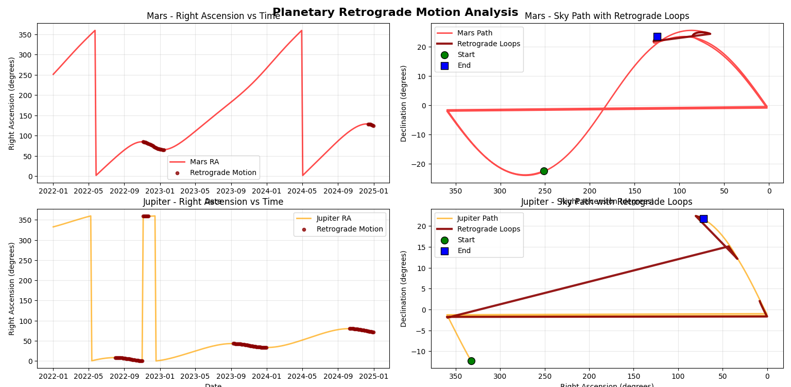
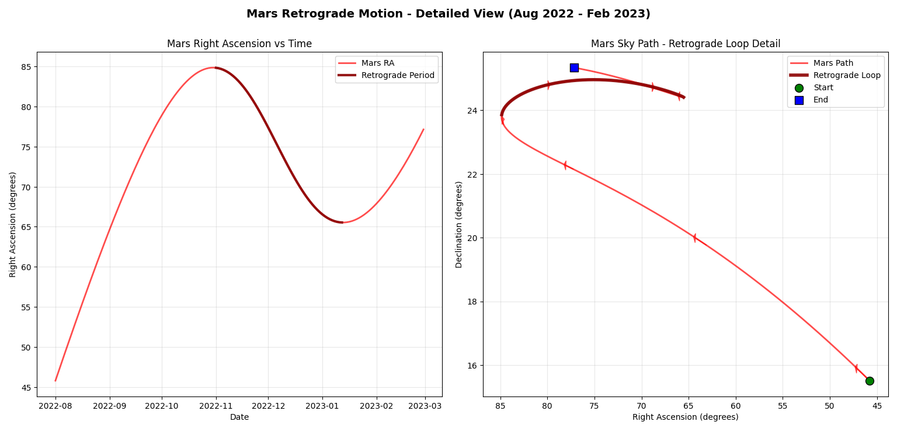

# 🌌 Planetary Retrograde Motion Analysis

This project visualizes and analyzes **retrograde motion** for planets as seen from Earth, specifically focusing on **Mars** and **Jupiter**. Retrograde motion is the apparent backward movement of a planet in the sky, caused by the relative motion of Earth overtaking slower-moving outer planets in their orbits.

---

## 🔭 Project Overview

The script utilizes **AstroPy** to compute accurate planetary positions using the **JPL ephemeris**. It performs the following:

- Computes **Right Ascension (RA)** and **Declination (Dec)** for planets over a time range.
- Detects periods of **retrograde motion** (when RA decreases over time).
- Visualizes:
  - RA over time with retrograde phases highlighted.
  - The apparent **sky path** (RA vs Dec) showing retrograde loops.
- Provides a **detailed retrograde view** for Mars during the Aug 2022 – Feb 2023 retrograde period.

---

## 📈 Outputs

### `Figure_1.png`: Overview of Retrograde Motion (2022–2024)
This figure contains 4 subplots:

| Subplot | Description |
|--------|-------------|
| Top-Left | Mars RA over time with retrograde periods highlighted |
| Top-Right | Mars sky path showing characteristic retrograde loop |
| Bottom-Left | Jupiter RA over time with retrograde periods highlighted |
| Bottom-Right | Jupiter sky path with retrograde loops visible |

🔁 **Retrograde Durations**:
- Mars: ~95.2 days
- Jupiter: ~318.6 days

---

### `Figure_2.png`: Detailed Mars Retrograde (2022 - 2024)
Zooms in on a specific Mars retrograde cycle, showing:
- Left: RA vs time with a highlighted retrograde segment.
- Right: Sky path of Mars including vector arrows for direction.

This highlights the **loop pattern** Mars traces in the sky during retrograde.

---

## 🧠 Scientific Background

- **Retrograde motion** is an optical illusion that occurs when Earth, on a faster inner orbit, overtakes outer planets like Mars or Jupiter.
- During this period, the outer planet appears to move backward (westward) in the sky temporarily.
- This phenomenon is periodic and can be predicted using ephemerides.

| Planet | Retrograde Cycle |
|--------|------------------|
| Mars | Every ~26 months |
| Jupiter | Every ~13 months |

---

## ⚙️ How It Works

1. **Dependencies**:
   - Python 3.x
   - `astropy`
   - `matplotlib`
   - `numpy`

2. **Key Functions**:
   - `calculate_planet_positions`: Computes apparent positions from Earth.
   - `detect_retrograde_periods`: Identifies when RA is decreasing.
   - `plot_retrograde_motion`: Generates overview plots for both planets.
   - `plot_mars_detailed_retrograde`: Zooms in on Mars retrograde.

3. **Ephemeris**:
   - High-precision kernel `de430.bsp` from JPL is used for accurate planetary data.

---

## 📂 Files Included

| File | Description |
|------|-------------|
| `retrograde_analysis.py` | Python script performing all calculations and plotting |
| `Figure_1.png` | Overview of Mars and Jupiter retrograde motion |
| `Figure_2.png` | Detailed view of Mars retrograde loop |
| `README.md` | Project description and documentation (this file) |

---

## 📜 Conclusion

This project demonstrates how to:
- Compute and visualize retrograde motion using real astronomical data.
- Understand the geometric cause of retrograde loops.
- Use scientific libraries for precise planetary analysis.

It serves as both a scientific visualization and educational tool to explain a fascinating astronomical phenomenon observable to the naked eye.

---

## 🪐 Future Improvements

- Add other planets (e.g. Saturn, Mercury) for comparison.
- Animate the retrograde motion as a time-lapse.
- Integrate with interactive sky maps (e.g., Plotly or WebGL).

---

## 📚 References

- NASA JPL Horizons: https://ssd.jpl.nasa.gov/horizons/
- Astropy Documentation: https://docs.astropy.org/
- Retrograde Motion Explanation: https://en.wikipedia.org/wiki/Apparent_retrograde_motion
